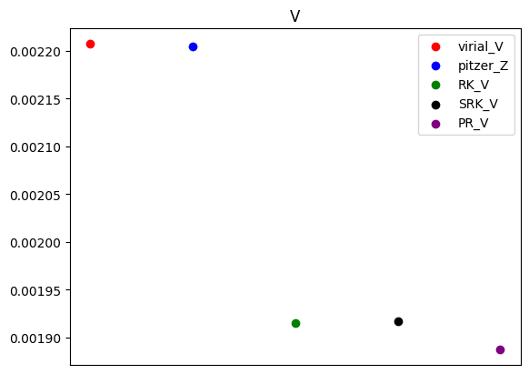
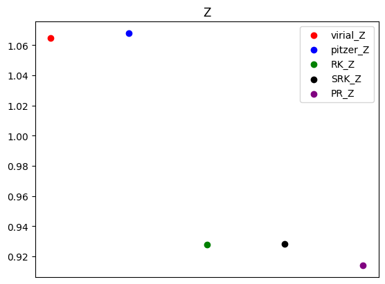

---
## 21101576 신강현 제 3장 연습문제 풀이 44, 61.


파이썬 라이브러리 `sympy`는 방정식을 문자그대로 전개할수있다.\
이를 이용해서 해석해를 구한다음 제시된 값을 구했다.

### 44
a) 

```python
import sympy as sp
import numpy as np
```
라이브러리를 선언해준다.

```python
B,C,P,T=140*1e-6,7200*1e-12,12e+5,298
R=8.314

P_sym,V_sym,T_sym,R_sym,Z_sym,B_sym,C_sym=sp.symbols('P,V,T,R,Z,B,C')
Bp_sym,Cp_sym=sp.symbols("B',C'")

Z1=1+B_sym/V_sym +C_sym/V_sym**2
Z2=1+Bp_sym*P_sym+Cp_sym*P_sym**2

Z1_func=sp.lambdify([B_sym,C_sym,V_sym],Z1,'numpy')
Z2_func=sp.lambdify([P_sym,Bp_sym,Cp_sym],Z2,'numpy')
```
물성값을 저장해주고 문자들을 선언해준다.\
비리얼식을 문자를 사용하여 선언한다.\
`sp.lambdify()`를 이용하여 Z1,Z2에 값을 집어넣을수 있도록 Z1_func,Z2_func로 새로운 함수를 선언한다.

```python
#Z1에서 P를 V에 관한 식으로 정리
a=sp.solve(Z1-(P_sym*V_sym/(R_sym*T_sym)),P_sym)
print('Z1에서 P를 V에 관한 식으로 정리')
print(sp.expand(a[0]))
```
`sp.solve()`는 f(x)=0 인 경우에만 쓸수있으므로 \
$Z_1-\frac{PV}{RT}$ 로 우변을 0으로 만든후 $P_{sym}=f(...)$ 꼴로 전개한다.\
`B*R*T/V**2 + C*R*T/V**3 + R*T/V` 가 출력된다.

```{python}
aa=Z2.subs(P_sym,a[0])
print('Z2에 정리한 P를 대입')
print(sp.collect(aa,1/V_sym))
```
Z2에 있는 P항에 위에서구한 P식을 대입하고 $\frac{1}{V}$기준으로 전개한다.\
`B'*R*T*(B*V + C + V**2)/V**3 + C'*R**2*T**2*(B*V + C + V**2)**2/V**6 + 1`이 출력된다.

```python
#Z2-Z1을 전개..

aaa=sp.collect(aa-Z1,Bp_sym)
print('Z2-Z1을 전개..')

print(sp.series(aaa,1/V_sym))

## 항별비교로 프라임계수를 알아냄.

Bpp_func=sp.lambdify((B_sym,R_sym,T_sym),B_sym/(R_sym*T_sym),'numpy')
Cpp_func=sp.lambdify((C_sym,R_sym,T_sym,B_sym),(C_sym-B_sym**2)/(R_sym*T_sym)**2,'numpy')
```
항별비교를 쉽게 하기위해 Z2-Z1=0꼴로 만들어 전개한다.\
`(2*B*C'*R**2*T**2 + B'*C*R*T)/V**3 + (B*B'*R*T - C + C'*R**2*T**2)/V**2 + (-B + B'*R*T)/V + C'*R**2*T**2*(B**2 + 2*C)/V**4 + 2*B*C*C'*R**2*T**2/V**5 + O(V**(-6), (V, oo))`
가 출력되며 $V^{-2}, V^{-1}$ 차항만 고려해주면 $B'=\frac{B}{RT}, C'=\frac{C-B^2}{(RT)^2}$ 임을 알 수 있다.\
B',C'에 물성값을 넣을수 있도록 함수로 선언해준다.

```python
zz=1+Bpp_func(B,R,T)*P+Cpp_func(C,R,T,B)*P**2
print('압축인자',zz)

v=sp.solve(zz-Z1,V_sym)

print('부피식',v)
v_func=sp.lambdify((B_sym,C_sym,R_sym,T_sym),v,'numpy')
print('부피',v_func(B,C,R,T))
```
B', C'을 구했고, 압력을 알고 있으므로 압축인자를 구하면\
`z=1.0648994031494337`가 나온다.\
부피를 구하기 위해 `v`에 $V_{sym}=f(...)$ 꼴로 전개해서 저장한다.\
함수로 만든후 값을 대입해서 부피를 구하면\
`[np.float64(-5.0257677645783186e-05), np.float64(0.0022074423851483156)]` 이 출력되고, \
이중에서 물리적으로 타당한 값은  $0.0022074423851483156m^3$ 이다.

---

b) 

일반화된 Pitzer 상관관계식은 $Z=1+\frac{BP}{RT}$이다.
```python
z_pitzer=1+(B_sym*P_sym)/(R_sym*T_sym)
print('pitzer식에서 z는',z_pitzer)
z_pitzer_f=sp.lambdify((B_sym,P_sym,R_sym,T_sym),z_pitzer,'numpy')
print('그 값은',z_pitzer_f(B,P,8.314,T))
```
식을 문자로표현하고 값을 대입하면\
z=1.0678083220184922 이다.

---

c)
RK

```python
#RK

b_sym,PSI_sym,OMEGA_sym,Tc_sym,Tr_sym,Pc_sym=sp.symbols('b,PSI,OMEGA,Tc,Tr,Pc')

Tc,Pc=282.3,50.4e+5
Tr,Pr=T/Tc,P/Pc

PSI=0.42748
OMEGA=0.08664
```
교재 694p 에 있는 물성표를 참고하여 변수에 저장했다.

```python
#P를 변수들로 나타냄..
alp=Tr_sym**-0.5

aT=PSI_sym*(alp*R_sym**2*Tc_sym**2/(Pc_sym))

b_RK=OMEGA_sym*R_sym*Tc_sym/Pc_sym
P_RK=(R_sym*T_sym/(V_sym-b_RK))-aT/(V_sym*(V_sym+b_RK))
print('RK에서 압력',P_RK)
P_RK_f=sp.lambdify((V_sym,PSI_sym,OMEGA_sym,T_sym,Tc_sym,Tr_sym,Pc_sym,R_sym),P_RK,'numpy')

#V에관하여 정리
```
R/K식대로 압력식을 전개했다.\
`-PSI*R**2*Tc**2/(Pc*Tr**0.5*V*(OMEGA*R*Tc/Pc + V)) + R*T/(-OMEGA*R*Tc/Pc + V)` 이 출력된다.\

```python
try:
  expr_Vn=sp.nsolve(P_RK_f(V_sym,PSI,OMEGA,T,Tc,Tr,Pc,R)-P,V_sym,0.0022074423851483156)
except:RuntimeError
```
`sp.nsolve()` 를 통해 Newton-Raphson법으로 해를 찾을수 있다.\
이상조건이나 위에서 구한 값들을 초기값에 넣어 봤으나\
이번 과제에서 대부분 수렴하지않거나 해석해와 차이가 커서 사용하지 않기로 했다.\

```python
expr_V=sp.solve(P_RK-P,V_sym)

print('부피에관하여정리하면',expr_V)
print('t수치해',expr_Vn)

expr_V_f=sp.lambdify((PSI_sym,OMEGA_sym,T_sym,Tc_sym,Tr_sym,Pc_sym,R_sym),expr_V,'numpy')

VV=expr_V_f(PSI,OMEGA,T,Tc,Tr,Pc,R)
print(VV)

V_RK=VV[1].real
z_RK=P*V_RK/(R*T)
print('z는',z_RK)
```
`exper_V`에 `P_RK-P`를 V=f(...) 꼴로 저장한다.\
VV에 물성값들을 넣은 값들을 저장하고 출력하면\
`[np.complex128(7.46744789458224e-05+4.905840460049226e-05j), (0.0019152943754416904-6.015641806494321e-20j), (7.467447894582229e-05-4.905840460049215e-05j)]`\
이 출력된다.\
이중 허수부의 값이 가장 작은게 물리적으로 타당한해이다.\
컴퓨터의 부동소수점 오차로 인해 방정식을 풀때 아주 작은 ($10^{-20}$ scale) 오차가발생할수 있기때문이다.\
$V=0.0019152943754416904m^3, Z=0.9276635555011231$ 이다.

---
d)
SRK

#SRK

```python
omega_sym=sp.symbols('omega')
omega=0.087


alp=(1+(0.48+1.574*omega_sym-0.176*omega_sym**2)*(1-Tr**(0.5)))**2
aT_SRK=PSI_sym*(alp*R_sym**2*Tc_sym**2/(Pc_sym))
b_SRK=OMEGA_sym*R_sym*Tc_sym/Pc_sym
P_SRK=(R_sym*T_sym/(V_sym-b_SRK))-aT_SRK/(V_sym*(V_sym+b_SRK))

P_SRK_f=sp.lambdify((V_sym,PSI_sym,OMEGA_sym,T_sym,Tc_sym,Tr_sym,Pc_sym,R_sym,omega_sym),P_SRK,'numpy')
```
694p에서 에틸렌의 $\omega$ 값을 찾아서 저장한다.\
책에나온대로 SRK식을 문자로 전개한다. \

```python
try:
  V_SRKn=sp.nsolve(P_SRK_f(V_sym,PSI,OMEGA,T,Tc,Tr,Pc,R,omega)-P,V_sym,0.0022074423851483156)
except:RuntimeError

V_SRK=sp.solve(P_SRK-P,V_sym)
print('부피에관하여정리하면',V_SRK)

V_SRK_f=sp.lambdify((PSI_sym,OMEGA_sym,T_sym,Tc_sym,Tr_sym,Pc_sym,R_sym,omega_sym),V_SRK,'numpy')

Vsrk=V_SRK_f(PSI,OMEGA,T,Tc,Tr,Pc,R,omega)

print("부피",Vsrk)
print('t수치해',V_SRKn)
Z_SRK=P*Vsrk[1].real/(R*T)
print('압축인자',Z_SRK)
```
RK와 같은 방식으로 부피를 구하면\
`[(7.394407707239073e-05+4.9533307621039795e-05j), (0.0019167551791885538+4.6118961502674845e-20j), (7.394407707239051e-05-4.9533307621039795e-05j)]`\
이고 역시 물리적으로 타당한 값은 $0.0019167551791885538m^3$이다.\
Z=0.9283710887216454이 나온다.

---
e)
PR

```python
sigma=1-2**0.5
epsilon=1-2**0.5
OMEGA_PR=0.07780
PSI_PR=0.45724

alp=(1+(0.3764+1.54426*omega_sym-0.26992*omega_sym**2)*(1-Tr_sym**(0.5)))**2
aT_PR=PSI_sym*(alp*R_sym**2*Tc_sym**2/(Pc_sym))
b_PR=OMEGA_sym*R_sym*Tc_sym/Pc_sym
P_PR=(R_sym*T_sym/(V_sym-b_PR))-aT_PR/((V_sym+epsilon*b_PR)*(V_sym+sigma*b_PR))

P_PR_f=sp.lambdify((V_sym,PSI_sym,OMEGA_sym,T_sym,Tc_sym,Tr_sym,Pc_sym,R_sym,omega_sym),P_PR,'numpy')
```
책에나온대로 변수들을 저장했다.

```python
try:

  V_PRn=sp.nsolve(P_PR_f(V_sym,PSI_PR,OMEGA_PR,T,Tc,Tr,Pc,R,omega)-P,V_sym,0.0022074423851483156)
except: RuntimeError

print('t수치해',V_PRn)

V_PR=sp.solve(P_PR-P,V_sym)
print('g해석해',V_PR)

V_PR_f=sp.lambdify((PSI_sym,OMEGA_sym,T_sym,Tc_sym,Tr_sym,Pc_sym,R_sym,omega_sym),V_PR,'numpy')

V_PRR=V_PR_f(PSI_PR,OMEGA_PR,T,Tc,Tr,Pc,R,omega)
print('g해석해',V_PRR)

Z_PR=P*V_PRR[1].real/(R*T)
print('압축인자',Z_PR)
```

RK,SRK 방식과 동일하게 부피와 압축자를 구했다.\
`[np.complex128(3.9213554644697e-05+4.87890977618477e-19j), (0.0018870248095402302+6.776263578034403e-20j), (0.00020464913171690214-5.421010862427522e-19j)]`\
허수부가 가장 작은 $0.0018870248095402302m^3$ 이 가장 타당한해이다.\
압축인자는 0.9139713281584859이다.

---

Z와 V의 경향은 아래와 같다.




비리얼식에비해 RK,SRK,PR 모두 작게 나왔다./

---

### 61. 

a) 
1.RK

44번과 같이 RK식으로 값을 구했다. \
먼저 몰부피를 구하고 전체부피에서 나누어서 몰수을 알안낸후 질량을 구했다.\
`[np.float64(9.736228254551008e-05), (5.0196073012959196e-05-0.00012411722625134297j), (5.0196073012959196e-05+0.00012411722625134297j)]`\
나오고 실수해 $9.736228254551008e-05m^3$이 물리적으로 타당한 해이다.\
몰부피를 구했으므로 질량을 구하면 46326.974697739395 g 이다.\
Z=0.04715695005215271이 나온다.

2.SRK

44번과 같이 SRK식으로 값을 구했다.\
`[9.642659025230458e-05, (5.0663919159561945e-05-0.00012522639481266453j), (5.0663919159561945e-05+0.00012522639481266453j)]`\
이 나오고 실수해 $9.642659025230458e-05m^3$가 물리적으로 타당한 해이다.\
질량은 46776.5166039582 g  나온다.\
Z=0.04670375202123914 나온다.

3.PR

44번과 같이 구했다.\
`[np.float64(4.403360220096084e-05), (0.0001139162650525839-0.00016267484025758697j), (0.0001139162650525839+0.00016267484025758697j)]`\
이나오고 실수해 $4.403360220096084e-05m^3$ 이 물리적으로 타당한 해이다.\
질량은 39594.87258398041 g나온다.\
압축인자는 0.02132746198340674나온다.\
Rk, SRK와 값이 상당히 다르다.\
교재 120p를 보면 고압조건에서 PR식이 RK식에비해 더 잘 맞음을 알 수 있다.\


경향도 44번과 비슷하다.


---


